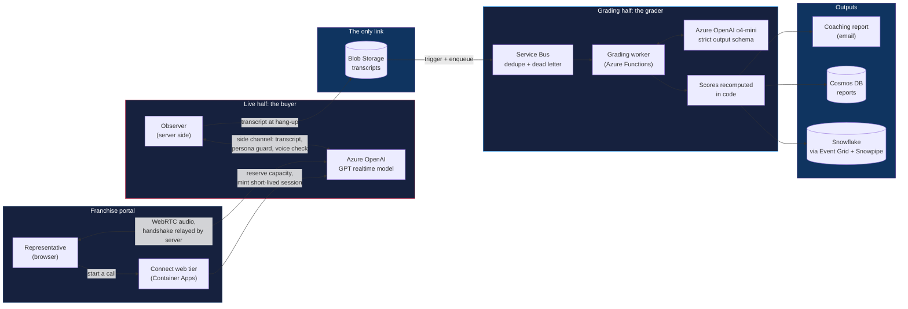

# Connect

> A real-time voice AI sales role-play platform. Sales representatives in a national in-home senior-care franchise network practice spoken calls against AI buyer personas, and a separate AI grader scores each finished call against the company's own sales rubric. I built it alone, from the first commit in January 2026 through the pilots and the rollout.

---

**This repository documents the architecture and design decisions for Connect. The implementation is private. No code, prompts, persona scripts, rubric text or data from it appear here; everything below is described in my own words.**

[Portfolio](https://jamesshehan.dev)

Other showcases: [Ratify](https://github.com/AIJSAI/ratify-showcase) · [Vinny](https://github.com/AIJSAI/vinny-showcase) · [Hive](https://github.com/AIJSAI/hive-showcase)

---

## What Connect Is

A representative opens Connect inside the franchise portal, picks a scenario and talks out loud with an AI buyer: a family member calling about care, or a referral source at a hospital, including regulated topics such as VA benefits. Each buyer has a personality, objections and a difficulty level; on inside-sales calls the representative does not know in advance who will answer. About two minutes after hanging up, a coaching report arrives by email: the score, strengths, gaps, one suggested focus, quotes from the representative's own words, and the full transcript.

The AI plays the buyer; it does not coach. The coaching lives in the graded report, and with the office owners who see where to focus their staff's practice.

## The Problem

Franchise offices had been paying for outside role-play tools or role-playing with each other, and the feedback depended on who happened to be coaching. Three constraints shaped the answer:

1. **Latency.** A spoken conversation breaks when the other side pauses. The buyer is built to answer within a one-second round trip, glass to glass.
2. **Grading depth.** Scoring a transcript against a multi-category rubric takes a reasoning model about a minute. That cannot sit inside a conversation.
3. **A regulated setting.** In-home senior care is HIPAA-regulated, and each franchise owner employs their own staff, so privacy and who may see a score are design inputs.

## Architecture

**Two halves joined only through storage.** A live half where the AI plays the buyer, and an asynchronous half where a separate AI grader scores the finished transcript, so grading never slows a reply. The split was decided before the build began and is still the shape of the product.

| Component | What it does |
|-----------|--------------|
| **Web tier** | Inside the franchise portal. Reserves capacity, mints a short-lived realtime session carrying the persona's instructions, and relays the WebRTC handshake; the browser never holds a key or sees the instructions |
| **GPT realtime model** | Plays the buyer over a direct WebRTC audio connection, in a voice chosen per persona |
| **Observer** | Joins every call over a server-side channel: captures the transcript that gets graded, re-asserts the persona if a browser tampers with the session, records the voice |
| **Service Bus + grading worker** | Duplicates dropped, failures kept. A reasoning model judges under a strict schema; code recomputes every total, bonus and band; calls spread over three model deployments with failover |
| **Outputs** | Coaching email, stored report, and an analytics record for office-level trends |

Everything runs on Azure, defined as Bicep. Detail: [docs/architecture.md](docs/architecture.md).

**Where it started.** Connect first ran on LiveKit, which carried the live audio while the realtime voice models matured. Once Azure offered generally available browser-direct WebRTC and a newer realtime model, I built the product's own WebRTC connection to Azure OpenAI, moved live calls onto it in August 2026, relaunched inside the franchise portal in September, and retired the first stack. The company now owns its scaling and pays no voice-platform fees.

## Key Decisions

| Decision | Choice | Why |
|----------|--------|-----|
| [Two halves](docs/architecture.md#two-halves-joined-only-through-storage) | Live buyer and asynchronous grader, joined through storage | A reply needs a second; a careful grade takes a minute |
| [D1: Voice stack](docs/decisions/01-first-voice-stack-and-direct-webrtc.md) | Start on a voice platform, then build a direct WebRTC connection to Azure OpenAI | Once Azure caught up, the lock-in was only the media transport |
| [D2: One voice](docs/decisions/02-split-pipeline-and-one-voice-check.md) | Split the voice pipeline; check every session for a single voice | A buyer who stops sounding like the same person breaks the exercise |
| [D3: Grader audit](docs/decisions/03-grader-audit-and-drift-gate.md) | Realign the grader to the official rubrics, then gate every grader change | Testing found half the outside-sales criteria missing |
| [D4: Coaching boundary](docs/decisions/04-coaching-boundary.md) | Office-level trends for coaching, never one representative's score | Franchise owners employ their own staff |
| [Honest practice](docs/architecture.md#honest-practice-by-construction) | Instructions never reach the browser; the server captures the transcript | Blind practice holds even if a browser is tampered with |
| [No call audio](docs/architecture.md#privacy-by-design) | Speech becomes text as the representative talks | Nobody listens to sessions |

## Quality and Testing

- **The arithmetic is pinned.** 101 tests fix the scoring math, and a separate gate proves that rewording a criterion cannot move a score. They run on every pull request.
- **Every grader change replays reference calls.** A required check grades fourteen reference transcripts three times each on the real staging grader and blocks the merge if scores drift beyond a noise-aware tolerance; nine red-team cases (prompt injection, score manipulation) must hold. It also runs weekly to catch drift in the model itself.
- **Hard calls are graded fairly.** Closing skill is judged against each persona's expected outcome, never curved, and switched on only after eight of nine personas held within model noise.
- **Deploys prove themselves.** Staging, then production behind an approval gate; images with high or critical vulnerabilities fail the build; a real grading smoke runs end to end; the voice routes are smoke-tested after every deploy.

Detail: [docs/testing.md](docs/testing.md) and [docs/evals.md](docs/evals.md).

## Rollout

- **Pilots, summer 2026.** I ran two pilot phases with franchise offices and sat with representatives as they used it. Every request got a recorded disposition with a reason. The pilots added difficulty levels and fuller reports, and the cast grew to nine buyer personas.
- **Launch in waves.** A slow rollout opened in August 2026, pilot offices first; each office passes a scripted go-live check before it opens. In September the product moved inside the franchise portal, and the rollout continues across the network in waves.
- **An incident, owned.** Mid-pilot, a fix for duplicate emails cut grading to about one session in seven for three days with no alert. I recovered the stranded reports, moved grading onto a queue with a single "already emailed" marker that cannot deadlock, and added the missing alerts.

## What I Learned

- **Build the exit before you need it.** The replacement voice path was built dark, compared in staging, switched, and the old stack kept as a hot fallback until a month showed it was never used.
- **A grader is the product's credibility.** Auditing it once was not enough; every change now replays reference calls before it can merge.
- **Score only what you can observe.** The inside-sales rubric was written for human mystery shoppers; points a transcript cannot show are not points a model should guess at.
- **Silent failures are the expensive ones.** The grading stall, a cutover that went quiet mid-call, and a probe watching an old address each now have a detector or an alert.

## Roadmap

- **Live customer calls.** I built and demoed a proof of concept for scoring live customer calls with Connect, not only practice calls; it has not been piloted and is on the 2027 roadmap.
- **The grader's successor model** already runs dark as a shadow grader ahead of the current model's retirement.
- **Report-only evals** (consistency, coaching quality, evidence grounding, a golden set) become blocking once human grades are final.

## Project Status

| Phase | Status |
|-------|--------|
| Build, January to May 2026 | Done |
| Franchise pilots, June and July 2026 | Done |
| Direct WebRTC voice path, July and August 2026 | Done |
| Franchise portal relaunch and first stack retired, September 2026 | Done |
| Rollout across the franchise network | In progress, in waves |
| Live customer calls | Proof of concept built and demoed; on the 2027 roadmap |

---

**Built by [James Shehan](https://jamesshehan.dev)**
