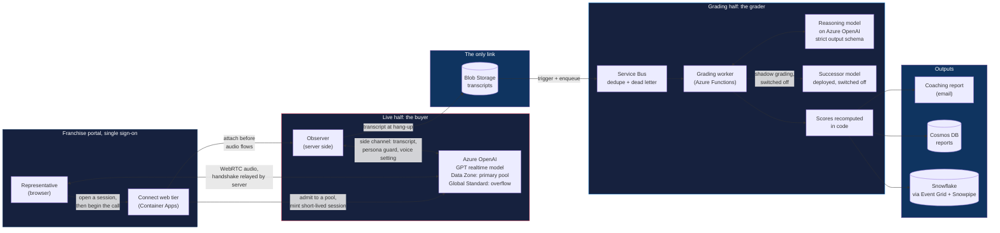

# Connect

> A real-time voice AI sales role-play platform built for a 480+ location in-home senior-care franchise network, where offices are enabled one by one as each signs its agreement. Sales representatives practice spoken calls against AI buyer personas, and a separate AI grader scores each finished call against the company's own sales rubrics for inside and outside sales. I built it alone from its first commit in January 2026, then ran its pilots and much of the rollout.

---

**This repository documents the architecture and design decisions for Connect. The implementation is private. No code, prompts, persona scripts, rubric text or data from it appear here; everything below is described in my own words.**

[Portfolio](https://jamesshehan.dev)

Other showcases: [Ratify](https://github.com/AIJSAI/ratify-showcase) · [Vinny](https://github.com/AIJSAI/vinny-showcase) · [Hive](https://github.com/AIJSAI/hive-showcase)

---

## What Connect Is

A representative opens Connect inside the franchise portal, picks a scenario and talks out loud with an AI buyer: a family member calling about care, or a referral source at a hospital, including regulated topics such as VA benefits. Each buyer has a personality, objections and a difficulty level; on inside-sales calls the representative does not know in advance who is calling. About two minutes after hanging up, a coaching report arrives by email: the score, strengths, gaps, one suggested focus, quotes from the representative's own words, and the full transcript.

The AI plays the buyer; it does not coach. The coaching lives in the graded report, and with the office owners who see where to focus their staff's practice.

## The Problem

Franchise offices had been paying for outside role-play tools or role-playing with each other, and the feedback depended on who happened to be coaching. Three constraints shaped the answer:

1. **Latency.** A spoken conversation breaks when the other side pauses, so the buyer is built against a design target of a one-second round trip.
2. **Grading depth.** Scoring a transcript against a multi-category rubric takes a reasoning model about a minute. That cannot sit inside a conversation.
3. **A regulated setting.** In-home senior care is HIPAA-regulated, and each franchise owner employs their own staff, so privacy shaped the design ([D4](docs/decisions/04-no-call-audio-and-no-scoreboard.md)).

## Architecture

**Two halves joined only through storage.** A live half where the AI plays the buyer, and an asynchronous half where a separate AI grader scores the finished transcript, so grading never slows a reply. The split was decided before the build began and is still the shape of the product.

| Component | What it does |
|-----------|--------------|
| **Web tier** | Served inside the franchise portal, behind the portal's single sign-on. Admits each call to a realtime pool, mints a short-lived session carrying the persona's instructions, and relays the WebRTC handshake; the browser never holds a key or sees the instructions |
| **GPT Realtime 2.1** | Plays the buyer over a direct WebRTC audio connection, in a voice chosen per persona. Two deployments of the same model: the faster Data Zone deployment is the primary pool, and a slower Global Standard deployment takes calls when the primary is full, trading speed for availability. Live transcription has run on the transcription model's successor since early October 2026 |
| **Observer** | Joins every call over a server-side channel before any audio flows, and a call it cannot join does not start. It captures the transcript that gets graded, re-asserts the persona if a browser tampers with the session, and records the voice setting the service reports |
| **Service Bus + grading worker** | Duplicates dropped, failures kept. A reasoning model on Azure OpenAI judges under a strict schema; code recomputes every total, bonus and band; calls spread over a pool of model deployments with failover |
| **Outputs** | Coaching email, stored report, and an analytics record for office-level trends |

The product runs on Azure, with every environment defined in Bicep; analytics land in Snowflake. Detail: [docs/architecture.md](docs/architecture.md).

**Where it started.** Connect first ran on LiveKit, which carried the live audio while the realtime voice models matured. Once they had, and Azure offered generally available browser-direct WebRTC, I built the product's own WebRTC connection to Azure OpenAI to remove the dependency on a voice platform and its fees. Live calls moved onto it in August 2026, and the first stack was retired in September. The company now owns its scaling, within its own Azure quota, and pays no voice-platform fees.

## Key Decisions

| Decision | Choice | Why |
|----------|--------|-----|
| [Two halves](docs/architecture.md#two-halves-joined-only-through-storage) | Live buyer and asynchronous grader, joined through storage | A reply needs a second; a careful grade takes a minute |
| [D1: Voice stack](docs/decisions/01-first-voice-stack-and-direct-webrtc.md) | Start on a voice platform, then build a direct WebRTC connection to Azure OpenAI | Once the realtime models matured on Azure OpenAI, the only lock-in left was the media transport |
| [D2: One voice](docs/decisions/02-split-pipeline-and-one-voice-check.md) | First design: split the voice pipeline so each persona kept one voice; replaced in August 2026 | A buyer who stops sounding like the same person breaks the exercise |
| [D3: Grader audit](docs/decisions/03-grader-audit-and-drift-gate.md) | Realign the grader to the official rubrics, then gate every grader change | Testing found half the outside-sales criteria missing, ten of the twenty |
| [D4: No call audio, no scoreboard](docs/decisions/04-no-call-audio-and-no-scoreboard.md) | Speech becomes text as the representative talks and only the text is graded; nobody listens in, and nothing ranks people | A practice tool that keeps recordings of people's voices, or ranks them, stops feeling like practice |
| [Two realtime pools](docs/architecture.md#capacity-two-pools-and-one-busy-screen) | The same model on two deployments, the faster one first, and a single busy screen with a retry countdown once both are full | Azure slows calls already in progress once a deployment's token rate is exceeded, rather than refusing new ones |
| [Model retirements](docs/architecture.md#model-retirements-planned-ahead) | Treat each retirement date as a scheduled product risk | A retired transcriber fails silently: the call still works, but no report arrives |
| [Honest practice](docs/architecture.md#honest-practice-by-construction) | Instructions never reach the browser; the server captures the transcript | Blind practice holds even if a browser is tampered with |

## Quality and Testing

- **The arithmetic is pinned.** 101 tests fix the scoring math, five of them in a gate that checks that rewording a criterion cannot move a score. They run on every pull request and every push.
- **Every grader change replays reference transcripts.** A required check grades fourteen reference transcripts three times each on the live staging grader and blocks the merge if scores drift beyond a noise-aware tolerance; nine red-team cases (prompt injection, score manipulation) must hold. It also runs weekly to catch drift in the model itself.
- **Hard calls are scored against their own goal.** Closing skill is judged against each persona's expected outcome rather than whether the AI agreed, and the total is never curved. The change went live only after a calibration in which eight of nine personas held within model noise; the ninth moved a little more and was reviewed and accepted.
- **Every deploy is checked.** Staging first, then production behind three approval gates, only one of which moves traffic, and that one is approved in a quiet window. Container images fail the build on any fixable high or critical vulnerability; an end-to-end grading smoke test runs on staging; the voice routes are smoke-tested after every deploy.
- **Infrastructure before code.** A deploy is blocked until any infrastructure change it carries has been applied to both staging and production, and documentation-only merges deploy nothing.

Detail: [docs/testing.md](docs/testing.md) and [docs/evals.md](docs/evals.md).

## Rollout

- **Pilots, summer 2026.** I ran two pilot phases with franchise offices and sat with representatives as they used it. By the August closeout, nearly every major suggestion had shipped, was being fixed before release or had a documented product decision. The pilots grew the buyer personas from six to nine and added difficulty levels and fuller coaching reports.
- **Launch in waves.** A slow rollout opened on August 18, 2026, with batched onboarding, pilot offices first, and widened across the network in waves from the portal launch on September 22. Each office passes a scripted go-live check before it opens.
- **Into the franchise portal.** In September I moved Connect inside the franchise portal by standing up a second front door beside the live one, so the old address kept serving until a redirect moved everyone across on the eve of the portal launch. Sign-in moved to the portal's single sign-on.

## What I Learned

- **Realtime capacity had to be measured.** A staging drill showed that a unit of realtime capacity behaves as a rate, not a seat, and scripted test calls showed the same model answering faster on one deployment type than another. Both findings changed the design: admission is decided before a call starts, and the faster deployment carries live calls first.
- **One audit of the grader was not enough.** Representatives trust the product only as far as they trust its scores, so every grader change now replays reference transcripts before it can merge.
- **The grader scores only what a transcript shows.** The inside-sales rubric was written for human mystery shoppers, and points a transcript cannot show are not points a model should guess at.
- **Each model retirement is a scheduled product risk.** Live transcription moved to its successor twelve days before the old model's retirement date, after a bake-off, and the grader's successor is ready behind shadow grading, a one-setting cutover and a dated check.

## Roadmap

- **The grader's next model.** As of October 2026, the grading model's successor is deployed and switched off. Shadow grading is built so real reports can be compared side by side before the switch, which is one setting. A dated check, run both as an alert rule and as a daily scheduled job, goes red if any grade still runs on the current model from nine days before its retirement.
- **Report-only evals.** Consistency, coaching quality, evidence grounding and a draft golden set run today without blocking a merge; the golden set becomes blocking once its human grades are final.

## Project Status

| Phase | Status |
|-------|--------|
| First build, January to May 2026 | Done |
| Franchise pilots, June and July 2026 | Done |
| Direct WebRTC voice path, July and August 2026 | Done |
| Franchise portal relaunch and first stack retired, September 2026 | Done |
| Two realtime pools and the transcription successor, October 2026 | Live in production |
| Grader successor | Deployed and switched off; a side-by-side comparison of real reports comes before the switch |
| Rollout across the franchise network | In progress, in waves |

---

**Built by [James Shehan](https://jamesshehan.dev)**
