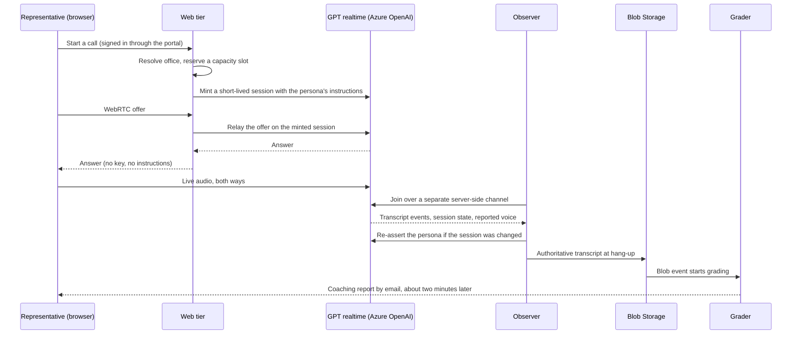

# Architecture: Connect

This page describes how Connect, a real-time voice AI sales role-play platform, is put together today (October 2026), and how it got there. It is written from the private repository's own engineering record, in my own words; no code, configuration or internal addresses are reproduced.

---

## Two Halves Joined Only Through Storage

A sales conversation and a careful grade want opposite things. The conversation needs the buyer to answer within about a second or it stops feeling like a call. A grade against a multi-category rubric takes a reasoning model about a minute. Putting both in one loop would make every reply wait on the slowest step.

So Connect is two halves that never call each other:

- **The live half** runs the conversation. The AI plays the buyer and nothing else.
- **The grading half** scores the finished transcript and sends the report.
- **Storage is the only link.** When a call ends, its transcript lands in Blob Storage, and that event starts grading.

The split was decided before the build began, against the one-second target, and survived the rebuild of the voice path unchanged.

## The Live Half

**Direct WebRTC to Azure OpenAI.** The browser holds a WebRTC audio connection straight to Azure OpenAI's GPT realtime model. There is no media server in between. The product's own server sets every call up: it reserves a capacity slot, mints a short-lived session that carries the persona's instructions, and relays the WebRTC handshake. The browser never holds a key and never sees the instructions.

**The observer.** A server-side process joins each call over a separate channel. It captures the transcript that will be graded, watches the session's settings, and records the voice the service reports for the session and for every conversation item.

**One voice per persona.** The realtime model speaks in its own built-in voice, chosen per persona when the session is minted. The observer's voice record feeds a dashboard that flags any session where the voice changed. The earlier design, where a separate speech engine spoke the model's words, is described in [D2](decisions/02-split-pipeline-and-one-voice-check.md).

**Capacity that fails cleanly.** Admission is decided per model pool against a fixed budget. A staging drill showed that a unit of realtime capacity behaves as a rate, not a seat, so the budget is set from measured behavior rather than the label. When the pool is full, the representative sees one busy screen with a retry countdown; calls already in progress are not degraded.

**Latency.** The target is a one-second round trip, glass to glass. Measured in October 2026, the median response per turn was about 0.6 seconds on the primary deployment and about 2 seconds on the global overflow pool. Leaving the first voice stack was never mainly about speed: the expected gain was well under a fifth of a second, because model inference dominates the turn.

## Honest Practice by Construction

A practice tool is only useful if its scores mean something, so the live half is designed so that gaming it does not work, rather than asking people not to try:

- **Blind practice holds.** The persona's identity and instructions travel only from the server to Azure. On inside-sales calls the representative cannot find out in advance who will answer.
- **Tampering is undone.** If a browser tries to change the session, the observer detects the divergence and re-asserts the persona's settings from the server.
- **The graded transcript is the server's.** A transcript posted by a browser could be forged, so the product never accepts one. The observer's capture is the only one graded.

## The Grading Half

**Resilient intake.** A transcript landing in Blob Storage triggers a thin enqueuer. A Service Bus queue with duplicate detection and a dead-letter queue feeds the grading worker, so a transcript is graded once and a failure is kept for inspection instead of lost. The coaching email is guarded by a single terminal "already emailed" marker that cannot deadlock (see the incident in [testing](testing.md#monitoring-and-incidents)).

**The model does the judging; code does the arithmetic.** The worker, an Azure Functions app, grades each transcript with a reasoning model (o4-mini) under a strict structured-output schema. The result is re-validated on the server, and every category total, bonus and band is recomputed deterministically instead of trusting the model's arithmetic. Calls spread across a pool of three model deployments with cooldown failover when one is rate limited.

**The rubric follows the call type.** Inside-sales calls are scored out of 90 and outside-sales calls out of 100, both normalized to 100 for analytics. The grader scores only what a transcript can show; see [D3](decisions/03-grader-audit-and-drift-gate.md).

**Difficulty without curving.** A hard persona is written to decline. The grader judges closing skill against that persona's expected outcome rather than whether the AI agreed, never curves the total, and adds difficulty only as a label.

**The successor model is already running.** A newer grading model is deployed dark as a shadow grader ahead of the current model's retirement, so the cutover is a configuration switch with evidence behind it.

## Outputs

Each graded session produces three things:

- **A coaching report by email** (Azure Communication Services): the score, strengths, gaps, one suggested focus, quotes from the representative's own words, and the full transcript. It arrives about two minutes after hang-up.
- **A stored report** in Cosmos DB.
- **An analytics record** that flows through Event Grid and Snowpipe into Snowflake, where office-level trends are built.

## Privacy by Design

- **No call audio is kept.** Speech becomes text as the representative talks, and only the text is graded.
- **Nobody listens to sessions.** There is no scoreboard and no ranking.
- **Erasure requests** cover the voice-path stores.
- **Office-level trends, never an individual's score,** for corporate coaching; see [D4](decisions/04-coaching-boundary.md).

## Inside the Franchise Portal

Since September 2026, Connect is served inside the franchise portal, behind the portal's gateway and its sign-in. Each person's office is resolved on the server from the portal, never taken from the browser, and the terms of use are accepted once per person per version.

## Platform

| Technology | Role | Why this choice |
|-----------|------|-----------------|
| Azure OpenAI GPT realtime model | The buyer's voice and reasoning | Generally available browser-direct WebRTC inside the Azure boundary the product already runs in |
| Azure Container Apps | Web tier and observer | Containers with platform-level authentication, no servers to manage |
| Azure Functions | Grading worker | Event-driven, scales with the queue |
| Azure OpenAI o4-mini | The grader | Reasoning quality with strict structured output |
| Azure Service Bus | Grading queue | Duplicate detection and a dead-letter queue |
| Azure Blob Storage | Transcripts | The only link between the halves; its events start grading |
| Azure Cosmos DB | Stored reports | Managed document store on the same platform |
| Azure Communication Services | Coaching email | Managed email delivery |
| Event Grid, Snowpipe, Snowflake | Analytics | Office-level trends without touching the live path |
| Key Vault, Application Insights | Secrets, telemetry, dashboards | Secrets stay out of code; the voice check and the operational alerts live here |
| Bicep | Infrastructure as code | Every environment is defined, reviewed and reproducible |

Azure offers realtime WebRTC in a limited set of regions, so region choice and capacity planning are part of the design rather than an afterthought.

## How It Got Here

| When | What changed |
|------|--------------|
| Before the build | The two-halves split decided against the one-second target |
| January 2026 | First commit. The first production stack ran on LiveKit Cloud, which carried the audio to an agent worker that drove Azure OpenAI's realtime model |
| May 2026 | The voice pipeline split to keep one voice per persona ([D2](decisions/02-split-pipeline-and-one-voice-check.md)) |
| June and July 2026 | Franchise pilots; grading moved onto Service Bus after a mid-pilot stall |
| July 2026 | Decision to move to Azure OpenAI's own browser-direct WebRTC; the new path built dark behind a flag |
| August 2026 | Live calls moved to the new path, with the first stack kept as a hot fallback ([D1](decisions/01-first-voice-stack-and-direct-webrtc.md)) |
| September 2026 | Relaunched inside the franchise portal; the first stack retired |

---

**Built by [James Shehan](https://jamesshehan.dev)**
