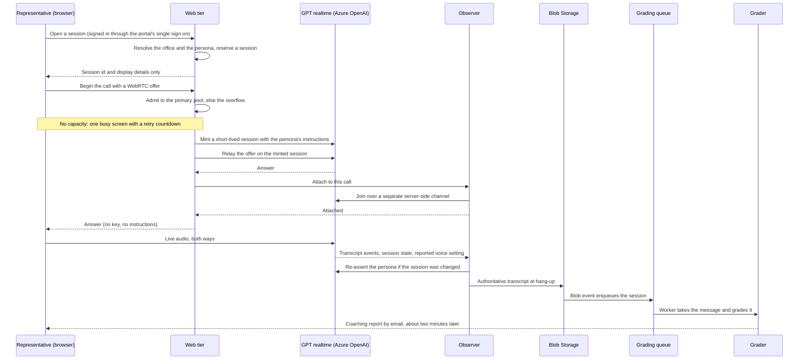

# Architecture: Connect

This page describes how Connect, a real-time voice AI sales role-play platform, is put together today (October 2026), and how it got there. It is written from the private repository's own engineering record, in my own words; no code, configuration or internal addresses are reproduced.

---

## Two Halves Joined Only Through Storage

A sales conversation and a careful grade want opposite things. A spoken conversation breaks when the other side pauses, so the buyer is built against a design target of a one-second round trip. A grade against a multi-category rubric takes a reasoning model about a minute. Putting both in one loop would make every reply wait on the slowest step.

So Connect is two halves that never call each other:

- **The live half** runs the conversation. The AI plays the buyer and nothing else.
- **The grading half** scores the finished transcript and sends the report.
- **Storage is the only link.** When a call ends, its transcript lands in Blob Storage, and that event starts grading.

The two-halves design was decided before the build began, against the one-second target, and survived the rebuild of the voice path unchanged.

## The Live Half

**Direct WebRTC to Azure OpenAI.** The browser holds a WebRTC audio connection straight to Azure OpenAI's GPT Realtime 2.1 model, served from two deployments of the same model. There is no media server in between. The product's own server sets every call up in two steps. When a representative opens a session, it resolves their office and the persona and reserves the session, and the browser gets back only an opaque id and what the screen displays. When the call begins, the server admits it to a capacity pool, mints a short-lived session that carries the persona's instructions, relays the WebRTC handshake, and has the observer attached before it hands the browser its answer. The browser never holds a key and never sees the instructions.

**The observer.** A server-side process joins each call over a separate channel before any audio flows, because the channel does not replay what happened before it joined. A call the observer cannot join does not start, since it would produce no report. The observer captures the transcript that will be graded, watches the session's settings, and records the voice setting the service reports for the session and for every conversation item.

**One voice per persona.** The realtime model speaks in its own built-in voice, chosen per persona when the session is minted. The observer's record feeds a dashboard that flags any session where the service-reported voice setting changed; it checks that setting, not the sound of the audio. The earlier design, where a separate speech engine spoke the model's words, is described in [D2](decisions/02-split-pipeline-and-one-voice-check.md).

**Transcription.** The representative's speech becomes text inside the realtime session, and that text is what gets graded. Since October 2026 it runs on the transcription model's successor; see [model retirements](#model-retirements-planned-ahead).

## Capacity: Two Pools and One Busy Screen

Live calls run on two deployments of the same realtime model. In scripted test calls against the production deployments in October 2026, the model's median time from the end of the representative's speech to the start of its reply was about 0.6 seconds on the Data Zone deployment and about 2 seconds on the Global Standard deployment of the same model, so the faster one became the primary pool and live calls go to it first. These are medians from scripted test calls, not from live traffic, and they measure the model's reply on the server, not the full round trip that the one-second design target describes. The overflow pool trades speed for availability: it answers more slowly, and it takes a call only when the primary is full or turns it away for capacity, so that call goes ahead instead of being refused.

A staging drill showed that once a deployment's token rate is exceeded, Azure slows the calls already in progress rather than refusing new ones: a unit of realtime capacity behaves as a rate, not a seat. So instead of raising the call ceiling on one deployment, I added a second realtime pool on quota the company already held, and admission is decided before a call starts. Each call is admitted to the faster pool first and the overflow pool second. Once both are full, new calls are turned away with one busy screen and a retry countdown before they could slow the calls already in progress.

Leaving the first voice stack was never mainly about speed: the expected gain was well under a fifth of a second, because model inference dominates the turn. The reasons were owning the product's scaling and paying no voice-platform fees; see [D1](decisions/01-first-voice-stack-and-direct-webrtc.md).

## Honest Practice by Construction

A practice tool is only useful if its scores mean something, so the live half is designed so that gaming it does not work, rather than asking people not to try:

- **Blind practice holds.** The persona's instructions travel only from the server to Azure, never to the browser. Inside-sales calls are blind: the persona's identity stays on the server too, and is revealed only after the call, so the representative cannot find out in advance who is calling. Outside-sales calls are guided and show who the representative is calling.
- **Tampering is undone.** If a browser tries to change the session, the observer detects the divergence and re-asserts the persona's settings from the server.
- **The graded transcript is the server's.** A transcript posted by a browser could be forged, so the product never accepts one. The observer's capture is the only one graded.

## The Grading Half

**Queued intake.** A transcript landing in Blob Storage triggers a thin enqueuer. A Service Bus queue with duplicate detection and a dead-letter queue feeds the grading worker, so a repeated event is dropped as a duplicate, a grade cut short by a host restart runs again, and a failure is kept for inspection instead of lost. The coaching email is guarded by a single terminal "already emailed" marker that cannot get stuck.

**The model does the judging; code does the arithmetic.** The worker, an Azure Functions app, grades each transcript with a reasoning model on Azure OpenAI under a strict structured-output schema. The result is re-validated on the server, and every category total, bonus and band is recomputed deterministically instead of trusting the model's arithmetic. Calls spread across a pool of model deployments with cooldown failover when one is rate limited.

**The rubric follows the call type.** Inside-sales calls are scored out of 90 and outside-sales calls out of 100, both normalized to 100 for analytics. The grader scores only what a transcript can show; see [D3](decisions/03-grader-audit-and-drift-gate.md).

**Difficulty without curving.** A hard persona is written to decline. The grader judges closing skill against that persona's expected outcome rather than whether the AI agreed, never curves the total, and adds difficulty only as a label.

## Model Retirements, Planned Ahead

Every model Connect runs on has a retirement date, so each one is treated as a scheduled product risk rather than a surprise.

- **Transcription moved twelve days early.** A retired transcriber fails silently: the call still works, but no report ever arrives. I picked the successor in a bake-off on scripted calls, where it had no failed transcriptions and a shorter transcript lag (0.58 against 0.72 seconds), and switched live transcription to it twelve days before the old model's retirement date. The switch was kept out of any window that changed the grader, since two changes to grading inputs at once cannot be told apart.
- **As of October 2026, the grader's successor is deployed and switched off.** Shadow grading is built so real reports can be compared side by side before the switch, which is one setting. Once shadow grading is switched on, the successor grades each report a second time after the representative's report has gone out, and its scores are stored for comparison and never emailed. A dated check, run both as an alert rule and as a daily scheduled job, goes red if any grade still runs on the current model from nine days before its retirement.

## Outputs

Each graded session produces three things:

- **A coaching report by email** (Azure Communication Services): the score, strengths, gaps, one suggested focus, quotes from the representative's own words, and the full transcript. It arrives about two minutes after hang-up.
- **A stored report** in Cosmos DB.
- **An analytics record** that flows through Event Grid and Snowpipe into Snowflake, where office-level trends are built.

## Privacy by Design

- **No call audio is kept.** Speech becomes text as the representative talks, and only the text is graded.
- **The product gives no one a way to listen to a session,** live or afterward.
- **There is no scoreboard and no ranking.**

These choices cover audio and ranking. The written transcript and report are kept and emailed, and the terms of use each person accepts say who receives them. The reasoning is in [D4](decisions/04-no-call-audio-and-no-scoreboard.md).

## Inside the Franchise Portal

Since September 2026, Connect is served inside the franchise portal, behind the portal's single sign-on. I moved it there by standing up a second front door beside the live one, so the old address kept serving until a redirect moved everyone across on the eve of the portal launch. Each person's office is resolved on the server from the portal's records, and the terms of use are accepted once per person per version.

## Platform

| Technology | Role | Why this choice |
|-----------|------|-----------------|
| Azure OpenAI GPT Realtime 2.1, on two deployments | The buyer's voice and reasoning | Generally available browser-direct WebRTC inside the Azure boundary the product already runs in; the faster Data Zone deployment is the primary pool, Global Standard the overflow |
| Azure OpenAI transcription model | The representative's speech as text | The successor model since October 2026, ahead of the old model's retirement |
| Azure Container Apps | Web tier and observer | Containers with platform-level authentication, no servers to manage |
| Azure Functions | Grading worker | Event-driven, scales with the queue |
| Azure OpenAI reasoning model (successor deployed and switched off as of October 2026) | The grader | Reasoning quality with strict structured output |
| Azure Service Bus | Grading queue | Duplicate detection and a dead-letter queue |
| Azure Blob Storage | Transcripts | The only link between the halves; its events start grading |
| Azure Cosmos DB | Stored reports | Managed document store on the same platform |
| Azure Communication Services | Coaching email | Managed email delivery |
| Event Grid, Snowpipe, Snowflake | Analytics | Office-level trends without touching the live path |
| Key Vault, Application Insights | Secrets, telemetry, dashboards | Secrets stay out of code; the voice check and the operational alerts live here |
| Bicep | Infrastructure as code | Every environment is defined, reviewed and reproducible |

Azure offers realtime WebRTC in a limited set of regions, so the region and the capacity of each deployment are chosen deliberately.

## How It Got Here

| When | What changed |
|------|--------------|
| Before the build | The two-halves split decided against the one-second target |
| January 2026 | First commit. From the first week, LiveKit Cloud carried the audio to an agent worker that drove Azure OpenAI's realtime model |
| May 2026 | A separate speech engine added to keep one voice per persona ([D2](decisions/02-split-pipeline-and-one-voice-check.md)) |
| June and July 2026 | Franchise pilots; grading moved onto a Service Bus queue |
| July 2026 | Decision to move to Azure OpenAI's own browser-direct WebRTC; the new path built dark behind a flag |
| August 2026 | Live calls moved to the new path, with the first stack kept as a hot fallback ([D1](decisions/01-first-voice-stack-and-direct-webrtc.md)) |
| September 2026 | Relaunched inside the franchise portal; the first stack retired |
| October 2026 | Two realtime pools, the faster deployment first; live transcription moved to its successor; the grader's successor deployed and switched off |

---

**Built by [James Shehan](https://jamesshehan.dev)**
